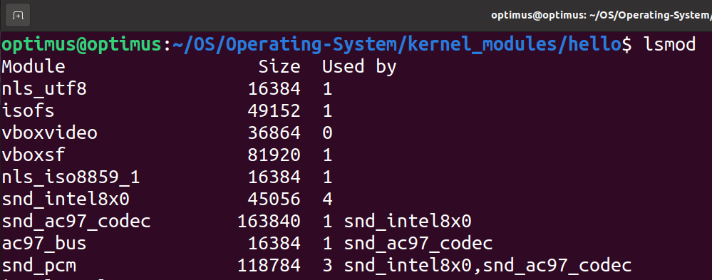
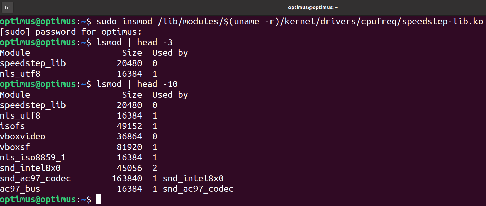
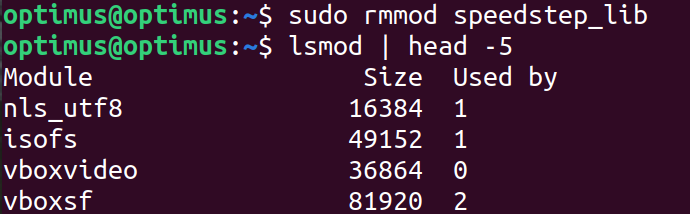
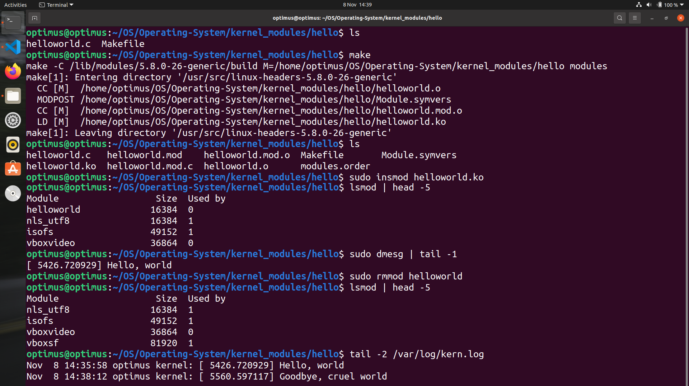

<h1 align="center">Operating System Concepts</h1>

Some Operating System concepts are explained with examples. Table of contents:

1. <a href="#file-handling">File handling system calls (open, read, write, lseek, close)</a>
2. <a href="#kernel-modules">Writing a Linux kernel module</a>
    - <a href="#first-module">First kernel module - helloworld</a>
   
<hr>
<h2 id="file-handling" align="center">File handling</h2>

Hopefully, explanation will be included soon here

<hr>
<h2 id="kernel-modules" align="center">Writing a Linux kernel module</h2> 

**Kernel modules** are piece of code, that can be loaded and
unloaded from the kernel on demand. This technique prevents recompiling the kernel or rebooting the system every time some module is needed. Kernel modules are intended to enhance the functionality of the kernel. A simple example of a module is a device driver – which enables the kernel to access a hardware component/device connected to the system.

All modules end with the **.ko** extension, and they are normally reside inside `/lib/modules/<kernel_version>/kernel/` directory. Kernel modules are usually loaded automatically as the hardware is detected at system boot. However, a system administrator can manage the modules using certain commands.

`lsmod` – lists modules that are already loaded

<p align="center">
  
</p>

`insmod` – inserts a new module into the kernel

<p align="center">
  
</p>

Above example, we inserted a built-in kernel module which is speedstep-lib. As you can see, this module resides in `/lib/modules/$(uname -r)/kernel/...` directory as we mentioned earlier. Here `$(uname -r)` is executed by shell and translated to our kernel version (in my case: `5.8.0-26-generic`).

Now in order to see the first 10 modules that already loaded. We typed: `lsmod | head -10`. Not surprisingly, module `speedstep_lib` is in the inserted modules list.

`rmmod` – removes a module from the kernel

<p align="center">
  
</p>

<h3 id="first-module" align="center">First kernel module - helloworld</h3>

Let's first create simple <a href="kernel_modules/hello/helloworld.c" target="_blank">helloworld.c</a> module in C programming language:

```C
#include <linux/init.h>
#include <linux/module.h>
MODULE_LICENSE("Dual BSD/GPL");

static int hello_init(void)
{
    printk(KERN_ALERT "Hello, world\n");
    return 0;
}

static void hello_exit(void)
{
    printk(KERN_ALERT "Goodbye, cruel world\n");
}

module_init(hello_init);
module_exit(hello_exit);
```

This module defines two functions, one to be invoked when the module is loaded into the kernel `hello_init` and one for when the module is removed `hello_exit`. The `module_init` and `module_exit` lines use special kernel macros to indicate the role of these two functions. Another special macro `MODULE_LICENSE` is used to tell the kernel that this module bears a free license; without such a declaration, the kernel complains when the module is loaded.

`printk` is a function that prints messages and is used in
the C Programming Language exclusively for the Linux
Kernel. It acts as a debugging tool for kernel programmers who need this function for logging messages from the kernel. **The string that we provided then printed to the kernel log.**

The last file that we need to add in order to compile our first kernel module is <a href="kernel_modules/hello/Makefile" target="_blank">Makefile</a>. *Please, note that Makefile first letter is capital "M" and next lines after `all:` and `clean:` targets are indented (not fulfilling these requirements causes errors):* 

```Makefile
obj-m := helloworld.o
all:
	make -C /lib/modules/$(shell uname -r)/build M=$(PWD) modules
clean:
	make -C /lib/modules/$(shell uname -r)/build M=$(PWD) clean
````
A **makefile** is simply a way of associating short names, called targets, with a series of commands to execute when the action is requested (for example when `make` is invoked from the command line, it reads a makefile and compiles module accordingly).

The first line above states that there is one module to be built from the object file helloworld.o. The resulting module is named helloworld.ko after being built from the object file.

`all` target denotes that if you invoke it, `make` will build all what's needed to make a complete build (considering any dependencies).

The next command starts by changing its directory to the one provided with the `-C` option (that is, your kernel source directory). The `M=` option causes that makefile to move back into your module source directory before trying to build the modules target. This target, in turn, refers to the list of modules found in the obj-m variable, which we’ve set to `helloworld.o` in our examples.

Finally, `clean` performs actions that clean up after the compiler removing object files and the resulting executable.

Now, we are ready to compile and insert our module to kernel:

<p align="center">
  
</p>

So, as you can see we have two files `helloworld.c` and `Makefile` in the current directory. By command `make`, we will compile `helloworld`. After compilation, we have some new files with **helloworld.ko** which is Linux kernel module (with extension `.ko`). Now we are inserting the module into the kernel. When a module is inserted, the `module_init` macro will be invoked, which will call the function `welcomeinha_init` (which writes "Hello, world" into the log file):

```bash
sudo insmod helloworld.ko
```
Now let's list the last 5 modules that are already loaded.

```bash
lsmod | head -5
```

Remind that printk function output is not displayed rather is written to kernel log file (which is in `/var/log/kern.log` file). In order to see the last line of the log file we type:
```bash
sudo dmesg | tail -1
```

Now let's remove the module from the kernel. When the module is removed with rmmod, `module_exit` macro will be invoked, which will call the `hello_exit` function (which writes "Goodbye, cruel world" into the log file):

```bash
sudo rmmod helloworld
```

An alternative way to seeing the contents of the log file is:
```bash
tail -2 /var/log/kern.log
```
